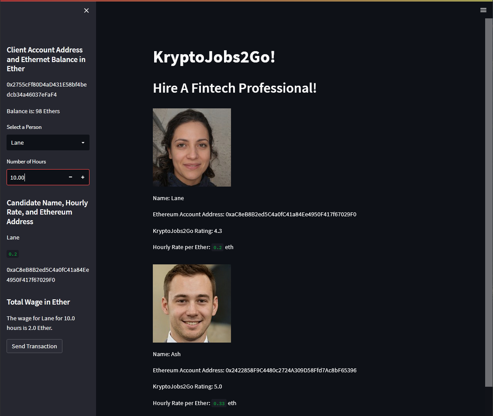
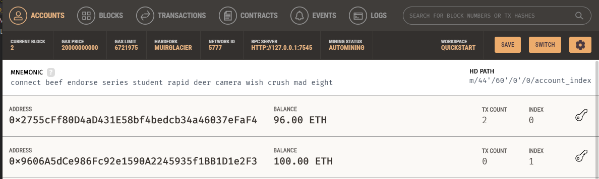
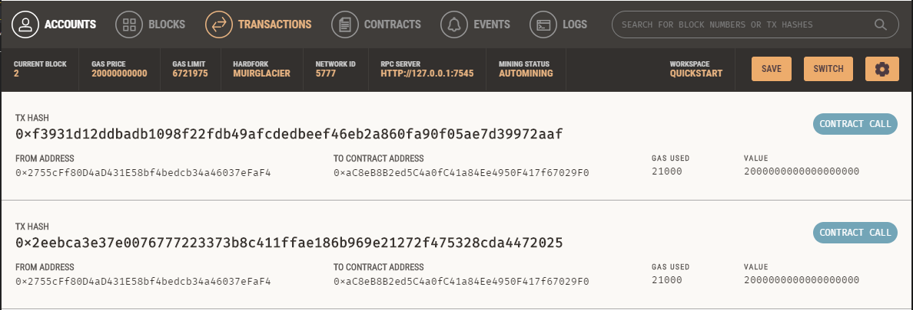

# Module 19 Challenge: KryptoJobs2Go

## Streamlit UI

Set up transaction to pay Lane for 10 hours of work:

"Send Transaction" results in transaction hash:

## Ganache local blockchain

Ganache account balance and transactions:

